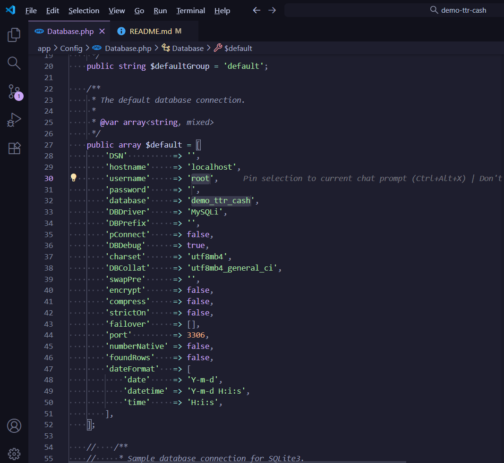
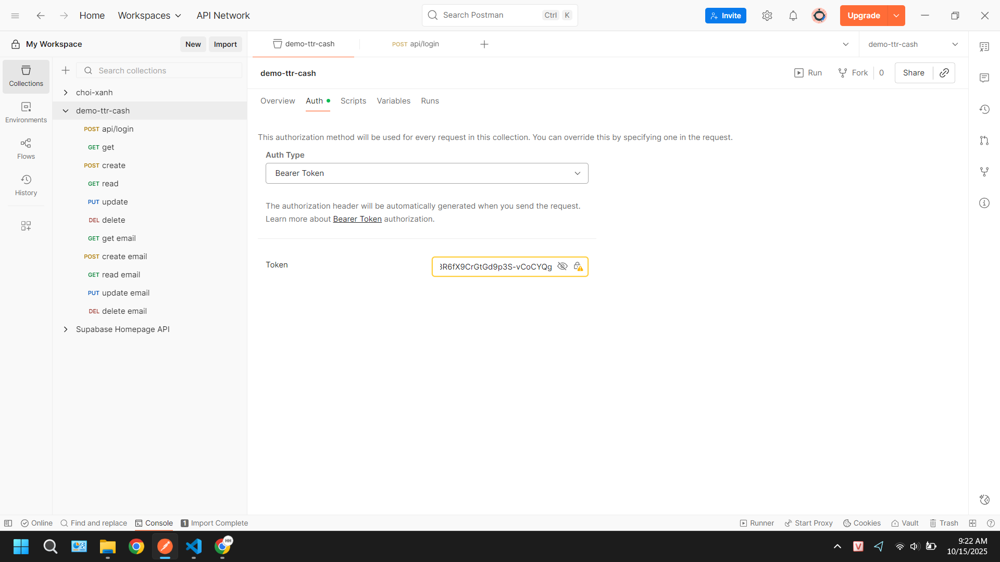

# Bài test CodeIgniter 4

## Chuẩn bị

mysql

php >= 8.1

composer >= 2.0.14

## Chạy dự án

1.  **Cài đặt các gói phụ thuộc:**
    Vào thư mục gốc của dự án và chạy lệnh:

    ```bash
    composer install --no-dev
    ```

2.  **Tạo file cấu hình:**

    Tạo file .env với biến jwt.secret = "chuỗi base 64 ít nhất 32 ký tự"

3.  **Cấu hình cơ sở dữ liệu:**

    Tạo cơ sở dữ liệu mới mysql

    Mở tệp `app/Config/Database.php` và điền thông tin kết nối cơ sở dữ liệu của bạn.

    

4.  **Thực thi Migration và Seed:**

    Chạy lệnh sau để tạo các bảng trong cơ sở dữ liệu và tạo dữ liệu mẫu:

    ```bash
    php spark migrate:refresh && php spark db:seed DatabaseSeeder
    ```

5.  **Chạy dự án:**

    Khởi động máy chủ phát triển bằng lệnh:

    ```bash
    php spark serve
    ```

6.  **Kiểm tra với Postman:**

    - Import collection Postman [demo](./doc/demo-collection.json).
    - Sử dụng route `login` để lấy token xác thực.
    - Cập nhật token trong cài đặt ủy quyền (authorization) của collection để sử dụng các api
      
